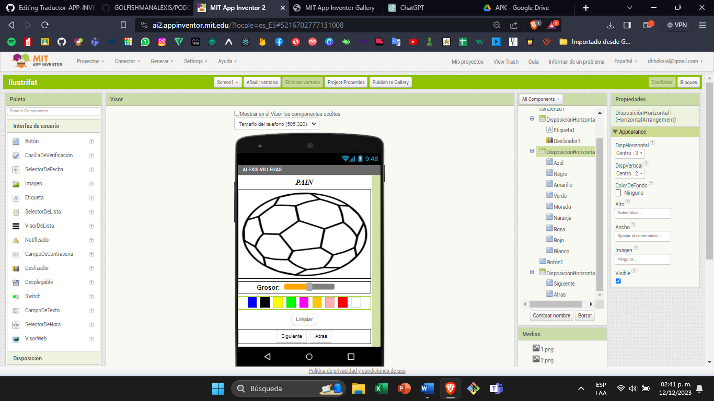
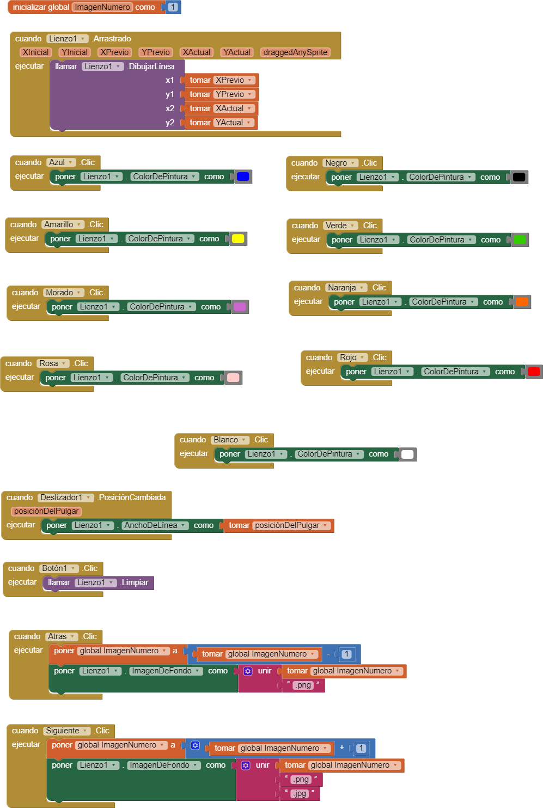

# PROYECTO 5 MINI PAINT

## PROPOSITO

El propósito de esta aplicación es utilizar el apartado o medio de canvas así como también los deslizadores para el cambio de grosor en el pincel

## ELEMENTOS DE LA APP

## Componentes del lienzo:

-   **Título:** Un Lienzo para realizar trazos.
-   **Disposición horizontal para trazos continuos:** Esta sección permite realizar trazos continuos y medir el grosor del pincel.
-   **Disposición horizontal para colores:** Contiene una variedad de colores disponibles para seleccionar.
-   **Botones de funcionalidad:**
    -   Botón de limpiar: Permite borrar el lienzo.
    -   Botón para el siguiente modelo: Avanza al siguiente modelo disponible.
    -   Botón para retroceder: Regresa al modelo anterior.

## BLOQUES

## Funcionamiento de los bloques

El funcionamiento de los bloques es el siguiente al inicio al inicializar con La variable se inicia el canva con la imagen al presionarle un color de los 8 seleccionados puedes pintar y ajustar al grosor con el deslizador los formatos que admite son PNG y jpge

## LINK DE GALERIA
<a href="https://gallery.appinventor.mit.edu/?galleryid=8f33c8fd-4dd4-4642-81fb-2e0b2ffe2b9b" style="text-decoration: none; display: inline-block; padding: 10px 20px; border: 2px solid #555; border-radius: 5px; background-color: #007bff; color: #fff; font-size: 16px;" rel="noopener">
  GALERÍA
</a>

## link de APK
<a href="https://drive.google.com/file/d/1Ftb9bevaDYGW0sLk3HmMmJtLb8gel4__/view?usp=sharing" style="text-decoration: none; display: inline-block; padding: 10px 20px; border: 2px solid #555; border-radius: 5px; background-color: #007bff; color: #fff; font-size: 16px;" rel="noopener">
  APK
</a>

